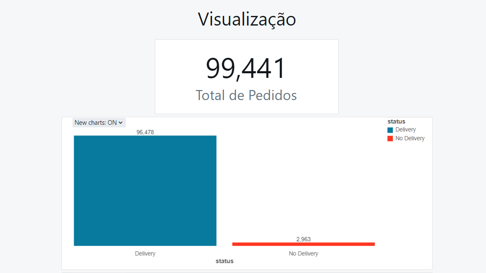
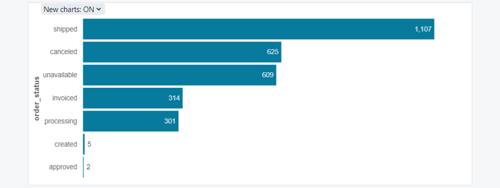
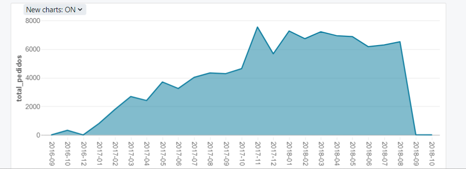
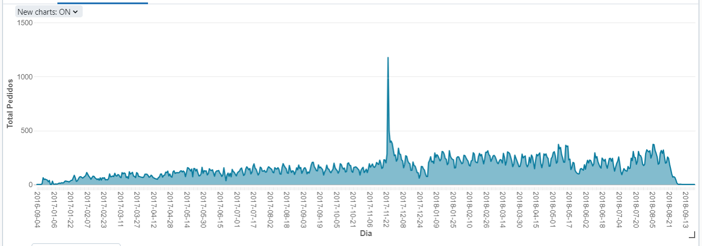

# Exploração de Dados:

## Quantidade de Pedidos

1. **Eficiência nas Entregas**: A diferença entre as barras é bastante acentuada, com a barra de entregas muito maior que a de não entregues. Isso sugere que a maioria dos pedidos é concluída com sucesso.

2. **Pedidos Não Entregues**: Apesar que a quantidade seja significativamente menor (aprox. **2,98%**), ainda representa uma quantidade de pedidos que não chegaram ao destino final. É importante entender os motivos por trás desses casos para melhorar a eficácia da entrega.

---

## Quantidade de pedidos por Status

1. **Maior Categoria**: A maior barra representa pedidos que foram enviados ("shipped"), indicando que esta é a etapa mais comum atualmente no status dos pedidos. Isso é esperado, já que em qualquer momento, muitos pedidos estarão em trânsito.

2. **Pedidos Cancelados**: A segunda maior barra indica uma quantidade significativa de pedidos cancelados. Isso pode sinalizar uma área que merece investigação, pois altas taxas de cancelamento podem indicar problemas no processo de compra, insatisfação do cliente ou problemas de estoque.

3. **Disponibilidade**: A terceira maior barra, "unavailable", sugere que muitos produtos não estão disponíveis. Isso pode ser um ponto de atenção para a gestão de estoque, podendo afetar a satisfação dos clientes e marketing negativo por falta de produtos.

4. **Processamento e Faturamento**: As barras para "processing" e "invoiced" mostram números menores. Isso aparentemente é normal, pois representam etapas transitórias rápidas no ciclo de vida de um pedido. Se esses números fossem anormalmente altos, poderia indicar gargalos no processamento de pedidos ou na faturamento da nota.

5. **Criação e Aprovação**: Existem muito poucos pedidos nas etapas iniciais de "created" e "approved". Isso pode indicar que os pedidos estão sendo processados rapidamente através dessas etapas iniciais, o que geralmente é um bom sinal de eficiência.

---

## Evolução ao longo do tempo

1. **Crescimento ao Longo do Tempo**: Existe uma tendência geral de crescimento no volume de pedidos ao longo do tempo, indicando um aumento na atividade de vendas ou na aquisição de clientes.

2. **Flutuações Sazonais**: Parece haver uma sazonalidade nas vendas, com picos e vales que podem corresponder a períodos específicos do ano, como feriados, eventos sazonais ou promoções.

3. **Pico de Vendas**: Houve um pico de vendas com mais de 1.000 pedidos em 24 de novembro de 2017, em pesquisas, nota-se que foi em função da Blackfriday.

4. **Queda Recente**: Há uma queda acentuada no número de pedidos no ponto mais recente do gráfico. Isso pode ser devido à dados incompletos para o mês mais recente.