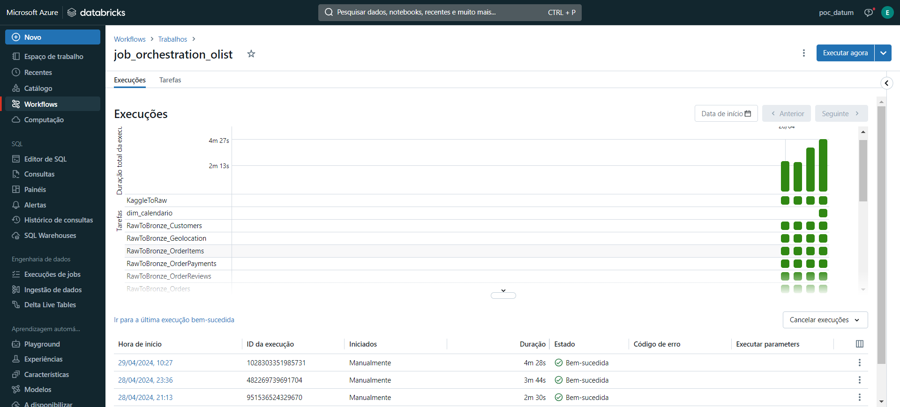
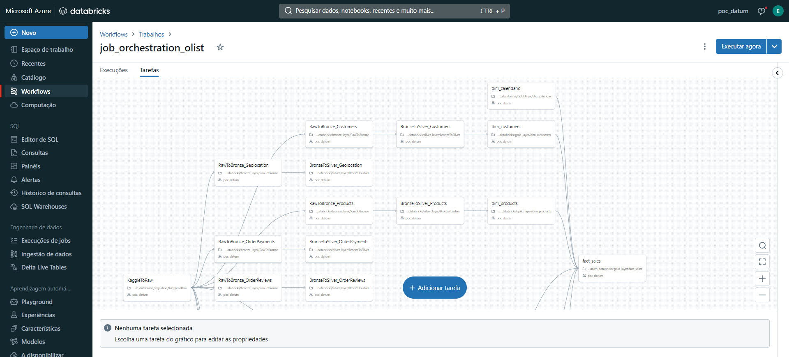
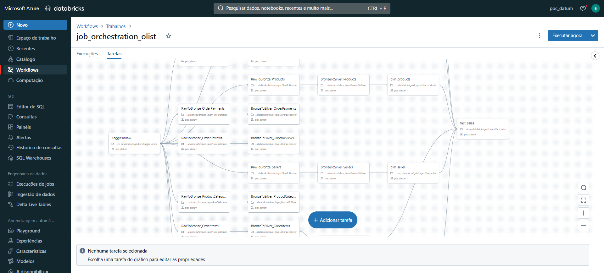
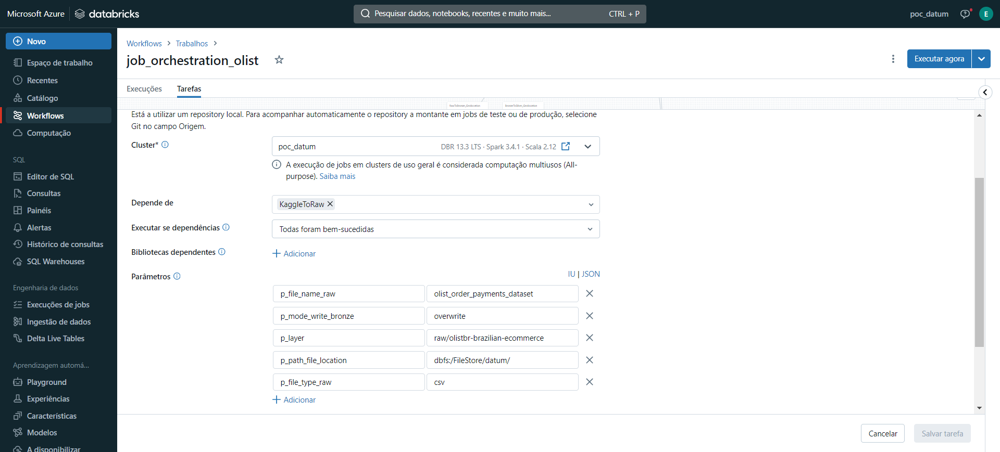

### Worflow

Conforme já mencionado, as jobs estão configuradas para garantir que a ingestão, o processamento e a modelagem dos dados sejam realizados sequencialmente, com a garantia de integridade e atualização dos dados.

## Job criada ##

---
## Detalhes da Job ## 

##  Linhagem ## 

## Uso de Variavéis ## 

O uso de variáveis nos jobs do Databricks é uma prática fundamental para tornar os pipelines de dados mais flexíveis e manuteníveis. Variáveis permitem a parametrização de partes do código, facilitando alterações em ambientes de desenvolvimento, teste e produção sem a necessidade de editar diretamente o código dos notebooks.