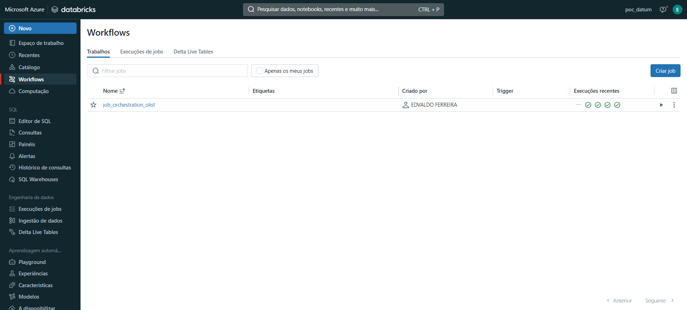

### Worflow

**Job criada**

**Detalhes da Job**

**Linhagem**

Conforme já mencionado, as jobs estão configuradas para garantir que a ingestão, o processamento e a modelagem dos dados sejam realizados sequencialmente, com a garantia de integridade e atualização dos dados.